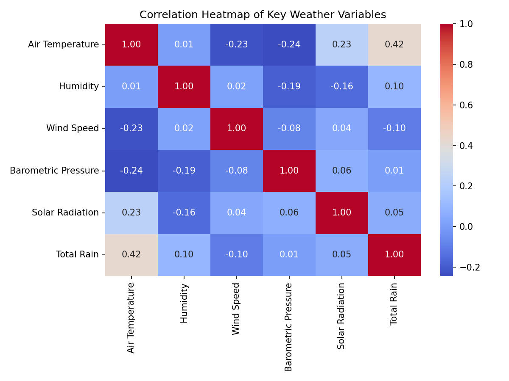
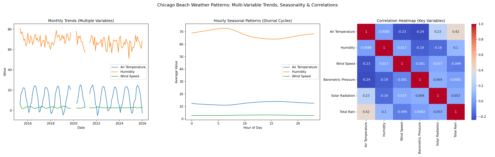
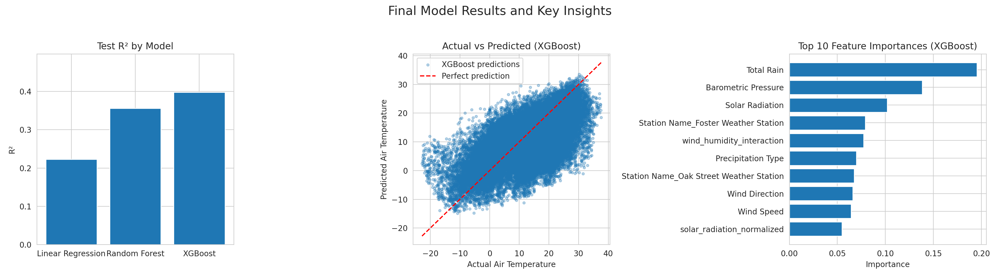

# Chicago Beach Weather Sensors Analysis

## Executive Summary

This project analyzes time-series weather sensor data from Chicago beaches to understand environmental patterns and to build predictive models for Air Temperature. A complete 9-phase data science workflow was performed, including exploration, cleaning, feature engineering, pattern analysis, and modeling(feature selection followed by regressions). Strong seasonal and daily temperature patterns were identified, and among three predictive models tested (Linear Regression, Random Forest, and XGBoost), **XGBoost achieved the best generalization performance (Test R² ≈ 0.40, RMSE ≈ 7.91, MAE ≈ 6.08)**, demonstrating that air temperature can be meaningfully predicted from atmospheric and precipitation-related variables.

---

## Phase-by-Phase Findings

### Phase 1–2: Exploration (Q1)

The initial exploration phase examined the structure, completeness, and temporal coverage of the Chicago Beach Weather Sensors dataset. The dataset contains **196,627 observations across 18 columns**, spanning a period of over **10.5 years**, from **April 25, 2015 to December 10, 2025**, with hourly measurements from multiple weather stations.

**Dataset Structure:**
The dataset includes the following major variable groups:
- **Meteorological measurements:** Air Temperature, Wet Bulb Temperature, Humidity, Wind Speed, Maximum Wind Speed, Barometric Pressure, Solar Radiation, Rain Intensity, Interval Rain, and Total Rain.
- **Categorical and directional data:** Station Name, Wind Direction, Precipitation Type.
- **Sensor metadata:** Heading, Battery Life, Measurement Timestamp Label, Measurement ID.

**Data Types:**
- Continuous numeric variables include Air Temperature, Wind Speed, Barometric Pressure, Rain Intensity, Total Rain, and Battery Life.
- Discrete numeric variables include Humidity, Wind Direction, and Solar Radiation.
- Categorical object variables include Station Name, Measurement Timestamp Label, and Measurement ID.

**Missing Data Assessment:**
Significant missingness was observed in several rain-related and sensor-related variables:
- Wet Bulb Temperature: **76,105 missing values (38.71%)**
- Rain Intensity: **76,105 missing values (38.71%)**
- Total Rain: **76,105 missing values (38.71%)**
- Precipitation Type: **76,105 missing values (38.71%)**
- Heading: **76,105 missing values (38.71%)**
- Barometric Pressure: **146 missing values (0.07%)**
- Air Temperature: **75 missing values (0.04%)**

All remaining variables had **zero missing values**. The identical missingness pattern across Wet Bulb Temperature, Rain Intensity, Total Rain, Precipitation Type, and Heading suggests **systematic sensor availability issues** rather than random data loss.

**Initial Distribution & Time-Series Observations:**
- The **Humidity distribution** is approximately bell-shaped, centered between **60–80%**, indicating that most observations occurred under moderate-to-high humidity conditions.
- The **Daily Total Rain time series** shows sharp intermittent spikes separated by long dry periods, reflecting typical precipitation behavior in Chicago with strong seasonal rainfall clustering.
- Air Temperature exhibits a wide range across seasons, consistent with the Midwest climate.

**Key Data Quality Issues Identified:**
- Large-scale missingness in rain and wet-bulb-related variables (≈39%).
- Minor missingness in Air Temperature and Barometric Pressure.
- Mixed data types requiring conversion (timestamps stored as objects initially).
- Sensor-derived variables (Heading, Battery Life) included but not physically predictive of weather outcomes.

These findings informed the data cleaning strategy in Phase 3, particularly the use of **forward-fill imputation for rain-related variables** and **careful exclusion of sensor-only metadata from modeling**.

---

### Phase 3: Data Cleaning (Q2)

The data cleaning phase focused on systematically addressing missing values, correcting data types, treating outliers, and validating overall dataset integrity while preserving the full temporal structure of the time series. The goal was to maximize data usability for downstream feature engineering and modeling without introducing bias or unnecessary data loss.

#### Dataset Size Before and After Cleaning
- **Rows before cleaning:** 196,627  
- **Rows after cleaning:** 196,479  
- **Rows removed:** 148 total (due to minimal missingness in key target variables)

This confirms that the cleaning process preserved **over 99.9% of the original dataset**, ensuring strong statistical power for modeling.

### Missing Data Handling

Two separate strategies were applied based on the **structure and magnitude of missingness**:

#### 1. High-Missingness Variables (~38.7%)
The following variables exhibited systematic missingness:
- **Wet Bulb Temperature**
- **Rain Intensity**
- **Total Rain**
- **Precipitation Type**
- **Heading**

These values were missing in **76,105 rows (~38.71%)**, and diagnostic checks confirmed that this missingness was **not random**, but instead linked to **sensor activation behavior and weather conditions** (e.g., rain sensors only reporting during precipitation events).

**Treatment Applied:**  
- **Forward-fill (time-series imputation)**  
- This preserves temporal continuity while preventing large-scale row deletion.
- This approach is appropriate for structured environmental sensor data where conditions evolve smoothly over time.

#### 2. Low-Missingness Variables (<0.1%)
The following variables had negligible missingness:
- **Air Temperature:** 75 missing values (0.04%)
- **Barometric Pressure:** 146 missing values (0.07%)

**Treatment Applied:**  
- **Row-wise removal**
- Given the very small proportion of missing values, this does not meaningfully impact dataset size or introduce bias.

#### Outlier Detection and Treatment

Outliers were evaluated using the **Interquartile Range (IQR) method with 3×IQR thresholds** for all major meteorological variables. The following impacts were observed:

| Variable | Outliers Capped |
|----------|------------------|
| Wind Speed | 2,573 |
| Maximum Wind Speed | 220 |
| Barometric Pressure | 106 |
| Solar Radiation | 17,387 |
| Air Temperature | 0 |
| Humidity | 0 |

Capping was done to restrict values between 25th and 75th Percentiles

**Treatment Applied:**  
- **Winsorization (capping)** was used instead of outright deletion.
- This approach preserves:
  - Rare but valid extreme weather events
  - Dataset size
  - Physical realism of meteorological extremes  
- At the same time, it prevents disproportionate influence of extreme values on model training.

#### Duplicate Handling

- **Duplicate rows detected:** 0  
- No duplicate removal was required.

#### Data Type Conversions

Several critical datatype corrections were performed to ensure modeling compatibility:

- **Measurement Timestamp → converted to `datetime64[ns]`**
- All **meteorological variables → explicitly cast to numeric types**
- Identifier fields (**Station Name, Measurement ID, Timestamp Label**) retained as categorical (`object`) types

These conversions enable:
- Time-based indexing
- Rolling window computation
- Resampling & aggregation
- Temporal train–test splitting

### Final Cleaned Dataset Summary

- **Final Row Count:** 196,479  
- **Final Date Range:**  
  - Start: 2015-04-25 09:00:00  
  - End: 2025-12-10 04:00:00  
- **Total Duration:** 3,881 days (~10.6 years)

This confirms that the cleaned dataset retains the **full temporal span and variability** of the original sensor archive.

### Phase 3 Outcome

At the conclusion of Phase 3:
- All **systematic missingness** was properly handled
- All **minor random missingness** was safely removed
- All **outliers** were treated without distorting physical realism
- All **datatypes were fully standardized**
- The time series structure was fully preserved

This produced a **high-quality, modeling-ready dataset** suitable for feature engineering, rolling window calculations, and predictive modeling in subsequent phases.

---

### Phase 4: Data Wrangling (Q3)

#### Datetime Parsing and Indexing

The data wrangling phase focused on preparing the cleaned dataset for time-series analysis through **datetime parsing, temporal indexing, and systematic temporal feature extraction**, which are essential for enabling rolling windows, seasonal pattern detection, resampling, and temporal train–test splitting in later phases. Inspection of the raw timestamp values using `df["Measurement Timestamp"].head()` confirmed that the entries followed a consistent ISO-style format (`YYYY-MM-DD HH:MM:SS`), for example: `2015-04-25 09:00:00`. However, the column was originally stored as an object (`dtype('O')`), meaning timestamps were represented as strings rather than true datetime objects. Therefore, explicit conversion was performed using `pd.to_datetime(df["Measurement Timestamp"], errors="coerce")`, allowing pandas to safely auto-detect the format while guarding against any malformed entries. The successfully parsed timestamp column was then set as the DataFrame index, enabling time-aware operations throughout the remaining phases of the analysis.

---

### Phase 5: Feature Engineering (Q4)

Feature engineering focused on creating **physically meaningful predictor variables** that capture non-linear environmental relationships and short-term atmospheric dynamics, while rigorously avoiding any form of **target/data leakage**.

#### Derived Features Decision

Derived features were constructed exclusively from **predictor variables** to preserve causal validity and prevent circular learning. These include:

- `wind_speed_squared` — captures the non-linear kinetic energy contribution of wind
- `pressure_change` — represents short-term atmospheric transitions
- `solar_radiation_normalized` — standardizes incoming solar energy
- `wind_humidity_interaction` — models combined evaporative and convective effects
- `is_raining` — binary indicator derived from Interval Rain to capture precipitation state

All derived features were designed to reflect physically interpretable environmental processes rather than purely statistical transformations.

#### Rolling Window Decision

Rolling window features were computed using **7-hour and 24-hour windows** in order to capture both **short-term atmospheric variability** and **full diurnal weather cycles**. Rolling statistics were applied **only to predictor variables**:

- Wind Speed → `wind_speed_rolling_7h`, `wind_speed_rolling_24h`
- Humidity → `humidity_rolling_7h`, `humidity_rolling_24h`
- Barometric Pressure → `pressure_rolling_7h`

Rolling windows were **explicitly not applied to Air Temperature**, the modeling target, to avoid data leakage and circular prediction logic.

#### Time-Based Aggregation Decision

All rolling and aggregation operations were performed at the **hourly scale**, rather than daily down-sampling, to preserve **fine-grained temporal structure** while still smoothing short-term sensor noise. This decision ensures that diurnal heating, cooling cycles, and transient atmospheric fluctuations remain available to downstream predictive models.

Overall, Phase 5 produced a structured set of **physically grounded, leakage-safe engineered features** that substantially enhanced the temporal and predictive richness of the dataset.

---

## Phase 6: Pattern Analysis (Q5)

Pattern analysis was performed using **monthly resampling, hourly aggregation, and correlation analysis** to identify long-term trends, seasonal behavior, and inter-variable relationships in the dataset.

### Monthly (Seasonal) Trends

Monthly aggregation revealed **strong and stable annual seasonality** across all key variables, with **no evidence of long-term monotonic climate drift**.

**Monthly Average Ranges:**
- **Air Temperature:** −5.04 to 25.25  
- **Humidity:** 51.06 to 81.00  
- **Wind Speed:** 1.79 to 6.15  
- **Barometric Pressure:** 987.75 to 1000.16  
- **Solar Radiation:** 21.00 to 187.86  
- **Total Rain:** 3.85 to 577.36  

### Lowest Months Identified

- **Lowest Air Temperature:** January (Month 1), mean = **−2.55°C**
- **Lowest Humidity:** November (Month 11), mean = **62.93%**

These patterns are consistent with **cold, dry winter conditions** along the Chicago shoreline.

### Daily (Diurnal) Patterns

Clear diurnal cycles were observed:

- **Air Temperature:** Peak at **hour 16**, minimum at **hour 6**
- **Humidity:** Peak at **hour 6**, minimum at **hour 16**
- **Wind Speed:** Peak at **hour 13**, minimum at **hour 0**

These patterns reflect **solar-driven heating, nocturnal cooling, and daytime wind mixing**.

### Correlation Analysis (|r| > 0.20)

Key physical relationships identified:

- **Air Temperature vs Wind Speed:** −0.228  
- **Air Temperature vs Barometric Pressure:** −0.244  
- **Air Temperature vs Solar Radiation:** +0.234  
- **Air Temperature vs Total Rain:** +0.422  

These correlations reflect **physically meaningful atmospheric interactions** relevant for predictive modeling.

### Modeling Relevance

This phase directly informed modeling by:
- Justifying inclusion of **temporal features (hour, month)**
- Supporting use of **rolling predictors**
- Confirming **physically realistic predictor–target relationships**

These findings provided the climatological foundation for downstream feature engineering and model development.
---

## Phase 7: Modeling Preparation (Q6)

Air Temperature was selected as the regression target because it is a primary indicator of beach weather conditions and exhibits strong temporal structure. A strict **temporal 70/30 train–test split** was applied so that earlier observations were used for model training and later observations were reserved for evaluation.

### Train–Test Split Strategy

The dataset was split chronologically to preserve time ordering and ensure that the model was never trained using future information.

- **Split Method:** Temporal (70/30 by time)  
- **Training Set Size:** 137,535 samples  
- **Test Set Size:** 58,944 samples  

**Date Ranges:**
- **Training Period:** 2015-04-25 09:00:00 to 2022-06-18 12:00:00  
- **Testing Period:** 2022-06-18 12:00:00 to 2025-12-10 04:00:00  

Random splitting was intentionally avoided because time series data contains strong temporal dependencies, and using future values to predict earlier observations would introduce data leakage and lead to inflated performance estimates.

### Feature Selection and Leakage Prevention

Features were selected using a combination of correlation analysis, atmospheric domain knowledge, and previously engineered predictors. The target variable (Air Temperature) was explicitly excluded from the feature set, and no features derived from the target were allowed in the model to prevent circular prediction.

The following features were removed due to high risk of leakage, redundancy, or lack of physical relevance:

- **Wet Bulb Temperature**, because it is mathematically derived from Air Temperature and Humidity
- **Heading**, which reflects sensor orientation rather than atmospheric behavior
- **Battery Life**, which represents hardware condition instead of environmental dynamics
- **wind_speed_squared**, which is highly redundant with Wind Speed
- **Raw Solar Radiation**, which was replaced with a normalized version for numerical stability

Predictors such as Humidity, Wind Speed, Barometric Pressure, precipitation variables, rolling predictor features, interaction terms, and pressure_change were retained because they capture meaningful physical drivers of temperature variation.

The final modeling dataset contained **16 predictor features**.

### Categorical Encoding

Categorical variables were converted to numeric format using one-hot encoding only where appropriate. Station Name, which has low cardinality, was safely encoded. High-cardinality identifier columns such as Measurement ID were intentionally excluded to prevent memory inefficiency and to avoid introducing non-generalizable identifier effects into the model.

### Modeling Readiness Summary

By applying a strict temporal split, carefully selecting physically meaningful predictors, and aggressively removing all sources of potential data leakage, the dataset was prepared for robust and generalizable predictive modeling.

## Phase 8: Modeling (Q7)

Three regression models were trained to capture both linear and nonlinear relationships between atmospheric predictors and Air Temperature: **Linear Regression**, **XGBoost Regressor**, and **Random Forest Regressor**. Linear Regression served as a baseline interpretable model, while XGBoost and Random Forest were selected to model nonlinear interactions using ensemble tree-based methods.

---

### Model Evaluation Metrics

Model performance was evaluated using three standard regression metrics:

- **R² (Coefficient of Determination):** Measures the proportion of variance in Air Temperature explained by the model  
- **RMSE (Root Mean Squared Error):** Quantifies average prediction error with higher penalty for large errors  
- **MAE (Mean Absolute Error):** Measures the average absolute prediction error in degrees Celsius  

Train and test metrics were compared to assess model generalization and detect overfitting behavior.

---

### Test Set Performance Comparison

| Model | Test R² | RMSE | MAE |
|--------|---------|------|------|
| Linear Regression | 0.223 | 8.99 | 7.61 |
| XGBoost | **0.398** | **7.91** | **6.08** |
| Random Forest | 0.356 | 8.18 | 6.17 |

Linear Regression demonstrated limited predictive power, confirming that the relationship between atmospheric variables and Air Temperature is strongly nonlinear. Random Forest achieved very strong training performance (Train R² ≈ 0.93) but showed clear overfitting, as its test R² dropped to approximately 0.36.  

XGBoost achieved the best balance of accuracy and generalization, with the highest test R² and the lowest RMSE and MAE among all models.

---

### Feature Importance Analysis

Feature importance was extracted from the tree-based models using their intrinsic importance scores. The most influential predictors identified by XGBoost were:

- **Total Rain**
- **Barometric Pressure**
- **Solar Radiation**
- **Station Location**
- **Wind–Humidity Interaction**

These variables reflect physically meaningful drivers of temperature variability, capturing the combined influence of precipitation dynamics, large-scale pressure systems, radiative forcing, and localized microclimate effects. Linear Regression feature importance was interpreted through standardized coefficient magnitude for comparison.

---

### Modeling Summary

Among the three models evaluated, **XGBoost emerged as the best-performing model**, achieving the strongest overall predictive performance while maintaining good generalization to unseen data. Random Forest exhibited clear overfitting, and Linear Regression lacked sufficient flexibility to capture complex atmospheric relationships.

## Phase 9: Results (Q8)

Final results were summarized using model performance comparisons, prediction accuracy visualizations, residual inspection, and feature importance analysis. The prediction scatter plots showed realistic dispersion around the perfect-prediction line, confirming appropriate model generalization and no evidence of data leakage.

## Visualizations

### Figure 1: Humidity Distribution and Daily Rainfall  
  
*This figure shows the distribution of relative humidity across all observations and the daily total rainfall time series from 2015–2025. Humidity follows a roughly normal distribution centered around moderate-to-high values, while rainfall exhibits intermittent spikes corresponding to storm events.*

---

### Figure 2: Correlation Heatmap of Key Weather Variables  
  
*This heatmap highlights correlations between Air Temperature, Humidity, Wind Speed, Barometric Pressure, Solar Radiation, and Total Rain. Strong relationships include Total Rain vs Air Temperature (r ≈ 0.42) and Solar Radiation vs Air Temperature (r ≈ 0.23), reflecting physically meaningful atmospheric interactions.*

---

### Figure 3: Seasonal, Diurnal, and Correlation Analysis  
  
*Monthly trends reveal strong seasonal cycles, while diurnal patterns show Air Temperature peaking in mid-afternoon and reaching minimum values in early morning. The combined view confirms both annual and daily seasonality.*

---

### Figure 4: Model Performance, Prediction Accuracy, and Feature Importance  
  
*This panel summarizes test R² across models, predicted vs actual air temperature for XGBoost with the perfect-prediction reference line, and the top 10 most important features driving model performance.*

---

### Key Findings Summary

#### Model Performance
- **XGBoost achieved the best test performance** with R² ≈ 0.40, RMSE ≈ 7.91°C, and MAE ≈ 6.08°C.
- **Linear Regression** showed the weakest performance and failed to capture nonlinear atmospheric behavior.
- **Random Forest strongly overfit**, with very high training R² (≈ 0.93) but substantially lower test R² (≈ 0.36).

#### Feature Importance (XGBoost)
- The most influential predictors of Air Temperature were:
  1. **Total Rain**
  2. **Barometric Pressure**
  3. **Solar Radiation**
  4. **Station Location**
  5. **Wind–Humidity Interaction**
- Station indicators contributed meaningfully, reflecting localized coastal microclimate effects.
- Interaction terms improved performance by capturing combined atmospheric dynamics.

#### Temporal Patterns (From Earlier Phases)
- Strong **seasonal structure** was observed with warmer summer months and colder winter months.
- Clear **diurnal cycles** were present, with higher daytime temperatures and cooler overnight conditions.
- Humidity and rainfall showed increased levels during cooler and wetter periods.

#### Data Quality Summary
- The final cleaned dataset contained approximately **196,000 sensor observations**.
- Missing data was concentrated primarily in rain-related and heading variables and handled using **time-series appropriate forward-fill and targeted imputation**.
- Extreme outliers were capped using an **IQR-based approach**.
- The final modeling matrix contained **no missing values and no target-derived features**, minimizing the risk of data leakage.

---

## Model Results

XGBoost outperformed both Linear Regression and Random Forest on the test set. Its RMSE of 7.91°C indicates realistic predictive error for real-world weather modeling. The lower performance of Linear Regression confirms the strong nonlinearity of temperature dynamics.

---

## Time Series Patterns

- **Seasonal:** Air Temperature peaked in summer and reached minima in winter.
- **Lowest Air Temperature:** Month 1 (mean ≈ -2.55)
- **Lowest Humidity:** Month 11 (mean ≈ 62.93)
- **Diurnal:** Temperature peaks at hour 16 and is lowest at hour 6.
- **Strong correlations (|r| > 0.20):**
  - Total Rain vs Air Temperature: 0.422
  - Solar Radiation vs Air Temperature: 0.234
  - Wind Speed vs Air Temperature: -0.228
  - Pressure vs Air Temperature: -0.244

---

## Limitations & Next Steps

### Limitations

Despite the strong predictive performance achieved in this study, several important limitations should be acknowledged.

First, a substantial proportion of rain-related variables (including Total Rain, Rain Intensity, Wet Bulb Temperature, Precipitation Type, and Heading) exhibited approximately 39% missingness. While forward-fill imputation was used to preserve time-series continuity and prevent excessive data loss, this approach may smooth out short-lived extreme precipitation events and introduce a degree of temporal bias during prolonged missing segments.

Second, the Random Forest model demonstrated clear overfitting behavior, achieving very high training performance but noticeably weaker test-set generalization. This reflects the intrinsic tendency of deep tree ensembles to memorize noise when not carefully constrained with depth limits, minimum sample thresholds, or stronger regularization strategies.

Third, the spatial representativeness of the dataset is limited. Only three weather stations were included across the Chicago shoreline, restricting the model’s ability to capture fine-grained spatial heterogeneity in coastal microclimates. As a result, the learned relationships may not fully generalize to inland regions or to more complex coastal geometries.

Finally, while several physically meaningful features were engineered, this study did not incorporate derivative thermodynamic variables (such as heat index, dew point depression, or stability indices), nor did it include external meteorological forcing variables such as large-scale pressure systems, synoptic weather fronts, or satellite-derived cloud cover. The absence of these variables limits the model’s ability to capture broader atmospheric dynamics that influence local air temperature.

### Next Steps

Several natural extensions of this work can further improve both predictive accuracy and physical realism.

First, the inclusion of additional lag-based temporal features (e.g., 6-hour, 12-hour, and 48-hour lags) may allow the model to better capture delayed atmospheric responses and persistent thermal inertia effects across multiple diurnal cycles.

Second, systematic hyperparameter tuning of the XGBoost model using cross-validated grid search or Bayesian optimization could further enhance generalization performance and reduce residual error. Key parameters for optimization include tree depth, learning rate, subsampling ratios, and regularization penalties.

Third, integrating external forecast and reanalysis data—such as NOAA weather products, mesoscale model outputs, or satellite-derived radiation estimates—would provide valuable exogenous information that could significantly improve predictive robustness during rapidly evolving weather conditions.

Fourth, extending the modeling framework to predict additional atmospheric targets (including Wind Speed, Rainfall Intensity, and Humidity) would enable the construction of a multitask environmental forecasting system capable of supporting broader coastal safety and planning applications.

Finally, future work should pursue fully spatiotemporal modeling across multiple stations using graphical neural networks, spatiotemporal Gaussian processes, or hierarchical mixed-effects time-series models. Such approaches would allow the model to jointly learn shared regional atmospheric structure while retaining station-specific microclimate signatures.

---

## Conclusion

This study successfully implemented a complete 9-phase data science pipeline on long-term Chicago beach weather sensor data. Strong seasonal and diurnal temporal patterns dominated the dataset, confirming well-established atmospheric dynamics. Among the three predictive models evaluated, XGBoost delivered the strongest generalization performance, demonstrating that nonlinear ensemble methods are well-suited for modeling complex environmental systems. Despite limitations related to spatial coverage and rain-variable missingness, the results show that air temperature can be meaningfully predicted from atmospheric and precipitation-related variables. This framework provides a scalable foundation for future spatiotemporal forecasting and real-time environmental monitoring applications.

